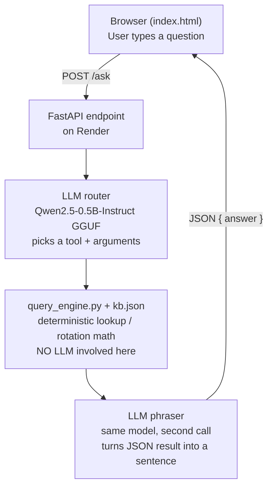

# KUET CSE Routine Assistant

A chat assistant that answers questions about the CSE department's 4th Year 1st Term class routine — including "tricky" questions like study hours, lab counts, and weekly rotations — by combining a tiny local LLM with a deterministic knowledge base, deployed as a free API on Render.

## Why not just feed the routine image/table straight to the LLM?

A 0.5B-parameter model is not reliable at multi-step counting or date-based rotation arithmetic over a table (e.g. "which subgroup has CSE4102 this week" or "how many *distinct* labs does A1 attend per week, given that rotating pairs count once, not twice"). Rather than trust the LLM to do that math, all of the actual logic lives in plain Python. The LLM only does two small, low-risk jobs:

1. Map the user's free-text question to one of a fixed set of function calls (a "tool").
2. Turn the structured result of that function back into a natural sentence.

Everything numeric — rotation parity, lab counts, contact hours — is computed in code, not generated by the model.

## How the knowledge base was built

The routine is a scanned table (see image above) with department-specific shorthand. Converting it to `kb.json` involved:

1. **Manual transcription** of every session (day, periods, course, teacher(s), section, subgroup) into a flat `sessions` array, one entry per class slot.
2. **Encoding the notation rules** from the routine's legend directly into the data, instead of leaving them implicit:
   - `c` suffix → `common: true` (two teachers listed, only one takes that specific instance).
   - `/` between teacher codes → `teacher_mode: "either"`.
   - `+` between teacher codes on a lab → `teacher_mode: "both"` (jointly conducted).
   - Even-numbered course codes → lab courses; odd-numbered → theory courses.
   - `CSE4000` → thesis slot, flagged `teacher_mode: "individual_supervisor"` since it's a personal supervisor meeting, not a shared class.
3. **Encoding the rotation logic as data, not prose.** Paired labs (e.g. CSE4102 ↔ CSE4112) are stored as two session objects sharing a `rotation_group` id, each with a `rotation_pattern` like `"A1_odd_A2_even"`. A `class_starting_date` in `meta` lets the code compute the current week number and parity, so "which subgroup does what this week" is a pure date calculation, never a guess.
4. **A verification pass** against the source image, double-checking the two asymmetric thesis slots (Section A meets supervisors Wed + Thu, Section B meets Tue + Thu) so that asymmetry isn't mistaken for a transcription error later.

The result, `kb.json`, is the single source of truth. `query_engine.py` never touches the LLM — it just reads this file and does lookups/arithmetic (`day_schedule`, `weekly_contact_minutes`, `total_labs_per_week`, `total_labs_per_week_subgroup`, `lab_rotation_today`, `teacher_schedule`, `free_periods`).

## System pipeline

Two LLM calls happen per question: one to *route* the question to a function, one to *phrase* the function's output. The actual answer — the numbers, the rotation parity, the lab counts — never comes from the LLM; it comes from `query_engine.py`.

## Why the responses are so slow

The backend is deployed on **Render's free tier**: 512 MB RAM and a shared 0.1 vCPU (effectively fractional single-core CPU), with no GPU. On top of that:

- The model runs via **`llama-cpp-python`, CPU-only inference** — there's no GPU acceleration available on the free tier, so every token is generated on that fractional CPU.
- The model is quantized aggressively (`q2_k` / `q3_k_s`) specifically to fit in 512 MB of RAM alongside FastAPI and the rest of the Python process — a smaller/more compressed model trades some quality and speed for fitting the memory budget at all.
- `n_threads=2` because the free instance doesn't have more usable CPU to parallelize across.
- **Two LLM calls per question** (router, then phraser) double the wait compared to a single-pass design.
- The free instance **spins down after inactivity** and takes 50+ seconds to cold-start on the next request, on top of normal inference time.

In short: tiny quantized model + CPU-only inference + 0.1 vCPU + two sequential LLM calls + cold starts. Upgrading the Render instance (more CPU/RAM, or a paid tier with no spin-down) would be the direct fix; alternatively, reducing to a single LLM call (e.g. combining routing and phrasing, or skipping the phrasing call and returning templated sentences) would roughly halve the model-side latency.

## Files

| File | Purpose |
|---|---|
| `kb.json` | The knowledge base — every session, teacher, course, and the rotation/notation metadata needed to interpret them. |
| `query_engine.py` | Pure-Python deterministic logic: rotation math, lookups, study-hour and lab-count calculations. No LLM calls. |
| `app.py` | FastAPI app: loads the GGUF model, exposes `/ask`, runs the router → query engine → phraser flow. |
| `Dockerfile` | Builds the container for Render, installing a pre-built CPU wheel for `llama-cpp-python` to avoid an in-build compile. |
| `index.html` | Static chat frontend; posts questions to the deployed `/ask` endpoint. |
